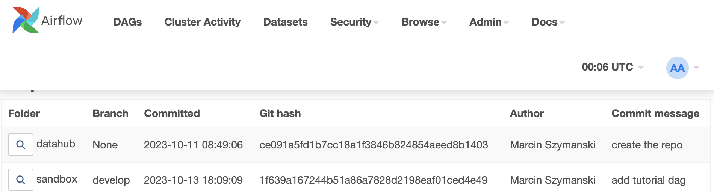

# Airflow Multirepo Deploy plugin

Airflow plugin for deploying DAGs from multiple Git repository from Airflow webserver.

The plugin scans every folder in Airflow DAGs folder (without subfolders),
and check if it's a git repository. It's intended to be used in a scenario where DAGs are
stored in a single shared volume. The volume must be mounted in the webserver too.

It's been designed for scenarios where Airflow is deployed in a Kubernetes cluster,
and multiple teams deploy their DAGs from separate repos.

## Features

* Deploy DAGs from multiple Git repos
* See deployed commit for each environment
* Easily switch between branches




## Installation

1) Install `gitpython` in your Airflow webserver
2) Clone this repo inside Airflow plugins folder
3) Configure your webserver to enable `git pull` on your DAGs repo (ssh keys, etc.)

## Usage

Clone your dag repos to the airflow DAGs folder.

### Airflow helm chart

To use this plugin with the official Airflow helm chart, you need to configure:
* `dags.persistence` to create a shared persistent volume
* `webserver.extraVolumes` and `webserver.extraVolumeMounts` to mount the volume in the webserver

### Configuration
You can set something like:
```
[multirepo_deploy]
allowed_branches=origin/main,origin/develop
```
te allow deployment only from predefined branches. For example, only `main` in production.

### Authentication
While you should configure the Git authentication specific to your environment,
the plugin supports multiple SSH keys (like GitHub deployment keys) out of the box.
For a given repo , simply store the SSH key in a file `<repo_folder_name>.key`
in the parent folder of the repo.